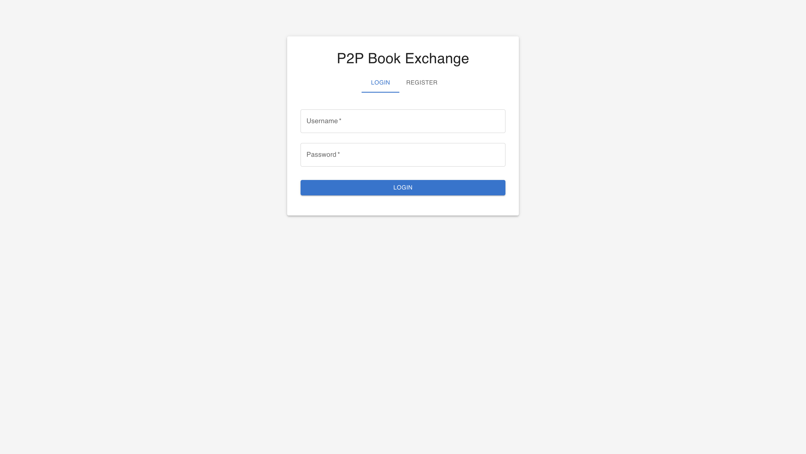
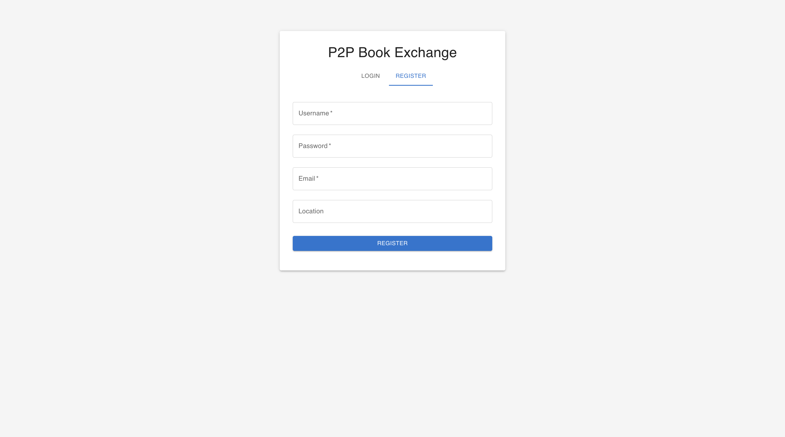
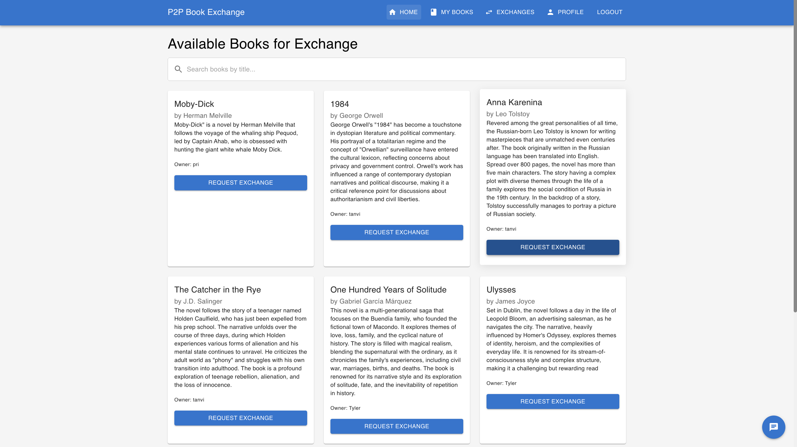
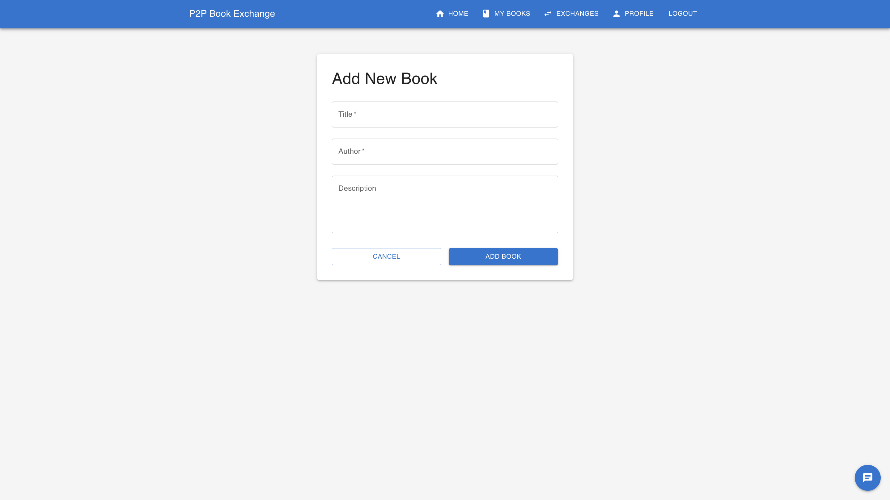
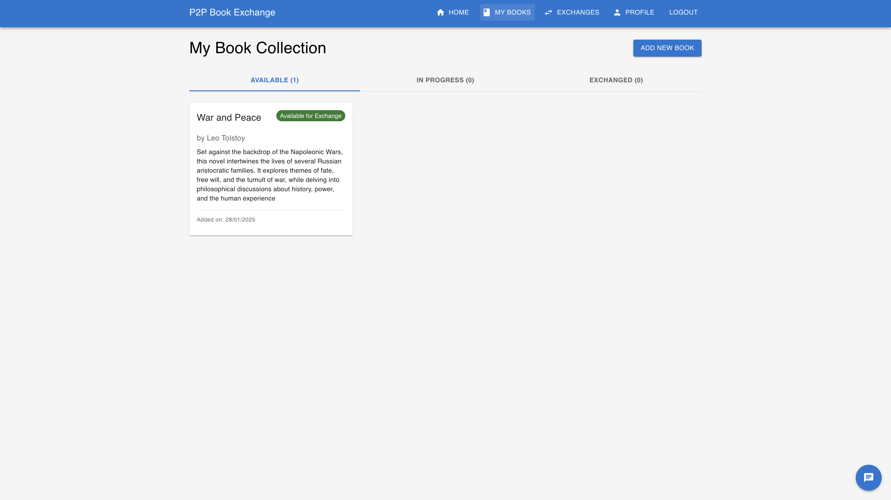
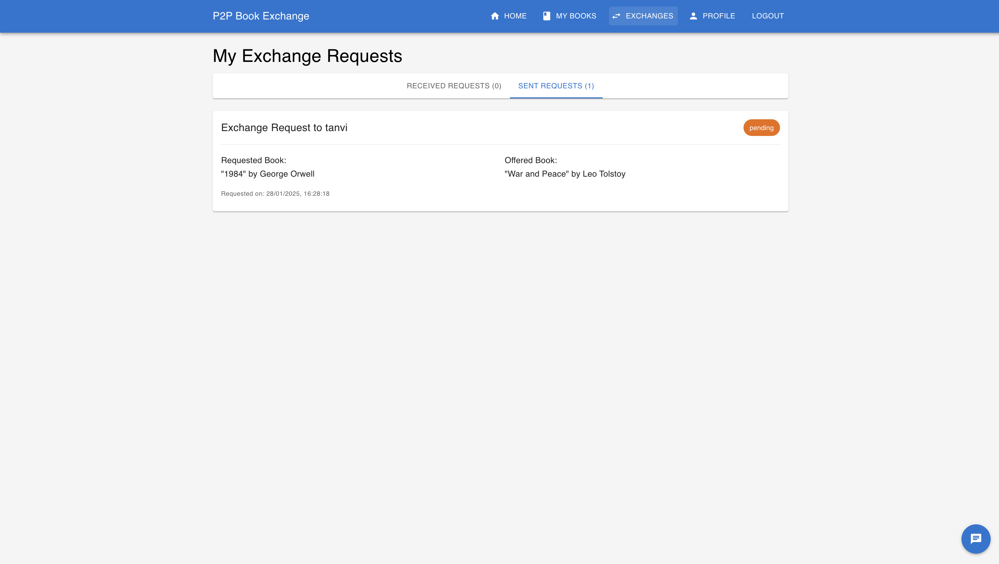
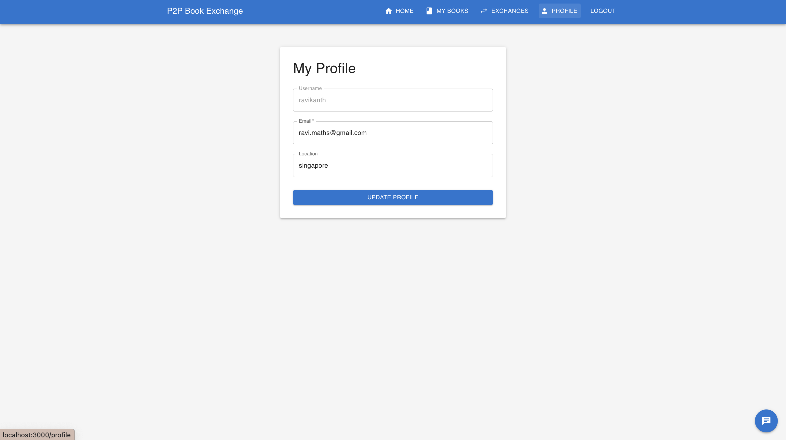
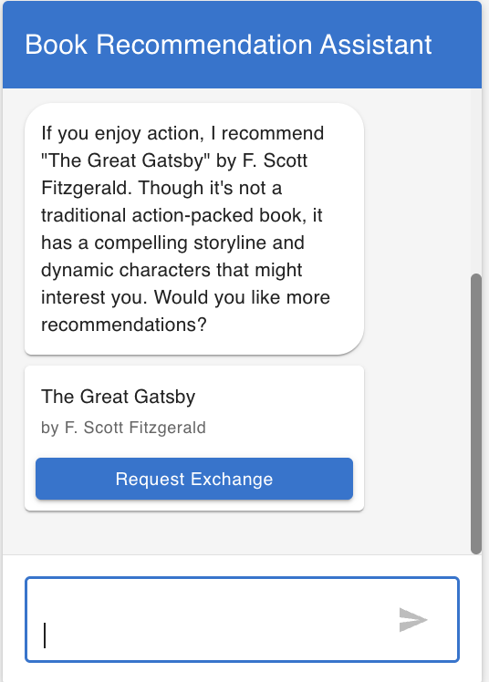

# P2P Book Exchange Platform

## Overview

This is a peer-to-peer book exchange platform designed for users to share and trade books with one another. The platform offers a sleek, user-friendly interface where you can add books you want to exchange, request specific books, track the status of your requests, and view a history of all your listed books. Additionally, it features a chatbot powered by OpenAI’s GPT-4o, which can recommend the best book for you based on your preferences.

## Features

### 1. Authentication System

- User registration with email, username, password, and location
- Secure login system with JWT authentication
- Protected routes for authenticated users
- Automatic session management

### 2. Book Management

- **Add Books**

  - Users can add books to their collection
  - Required fields: title, author
  - Optional: description

- **View Books**

  - Home page displays all available books for exchange
  - Search functionality to filter books by title
  - Books are organized in a grid layout with detailed information

- **My Books Section**
  - Three categories:
    - Available Books (ready for exchange)
    - In Progress (books involved in pending exchanges)
    - Exchanged Books (completed exchanges)
  - Status indicators for each book
  - Comprehensive view of user's book collection

### 3. Exchange System

- **Request Exchange**

  - Users can request to exchange books
  - Two options for exchange:
    - Offer an existing book from their collection
    - Offer a new book not yet in the system

- **Exchange Management**
  - Users can view both sent and received exchange requests at exchanges page
  - Status tracking of user's books(pending, accepted, rejected)
  - Automatic status updates for related exchanges
  - Prevention of multiple exchanges for the same book

### 4. AI-Powered Book Recommendations

- **Intelligent Chatbot**

  - Powered by OpenAI's GPT model
  - Maintains conversation context
  - Accessible through a floating chat interface
  - Direct exchange request capability from chat

- **Smart Recommendations**
  - Based on user preferences and available books
  - Contextual understanding of user requests

### 5. User Interface

- **Responsive Design**

  - Works on desktop and mobile devices
  - Clean and intuitive layout
  - Material-UI components for consistent styling

- **Interactive Elements**
  - Real-time feedback on actions
  - Loading states and error handling
  - Smooth transitions and animations

## Technical Stack

### Frontend

- React.js
- Material-UI (MUI)
- React Router for navigation
- Axios for API calls
- JWT for authentication

### Backend

- Flask (Python)
- SQLAlchemy for database management
- Flask-JWT-Extended for authentication
- OpenAI API for chatbot functionality
- SQLite database

## Setup and Installation

1. **Clone the Repository**

```bash
git clone [repository-url]
cd book-exchange
```

2. **Backend Setup**

```bash
cd server
python -m venv venv
source venv/bin/activate  # On Windows: venv\Scripts\activate
pip install -r requirements.txt
```

3. **Environment Variables**
   Create a `.env` file in the server directory:

```plaintext
FLASK_APP=app.py
FLASK_ENV=development
SECRET_KEY=your-secret-key
JWT_SECRET_KEY=your-jwt-secret-key
OPENAI_API_KEY=your-openai-api-key
```

4. **Frontend Setup**

```bash
cd client
npm install
```

5. **Run the Application**

```bash
# Start backend (from server directory)
python app.py

# Start frontend (from client directory)
npm start
```

## Usage Guide

### 1. Getting Started

- Register an account with email and username
- Log in to access the platform features
- Add books to your collection

### 2. Exchanging Books

- Browse available books on the home page
- Use the search function to find specific books
- Click "Request Exchange" on any book
- Choose a book to offer or add a new one
- Wait for the owner's response

### 3. Managing Exchanges

- Check "My Exchanges" for exchange requests
- Accept or reject incoming requests
- Monitor exchange status
- View exchange history

### 4. Using the AI Assistant

- Click the chat icon in the bottom right
- Ask for book recommendations
- Describe your preferences
- Request exchanges directly through chat

## Possible Short-Term Improvements

- Code Readability: Enhance code quality with better formatting and more comments.
- Improved UI: Design a more engaging and vibrant interface to improve user experience.
- More Book Details: Include book images, genres, and other relevant information to simplify selection.
- Enhanced Security: Implement two-factor authentication and robust data encryption to safeguard user data.

## Possible Long-Term Features and Enhancements

- User Interactions: Add direct messaging and a friend system for better social engagement.
- Community Features: Enable book ratings, likes, and social sharing options to foster community involvement.
- Rental System: Introduce a time-based rental feature with deposit tracking.
- Mobile Experience: Develop dedicated apps for iOS and Android for seamless mobile access.
- Discovery Tools: Include wishlist notifications and ISBN scanning for easier book discovery.

## Web App Screens Overview

### Login Page



### Register Page



### Home Page



### Add New Book Page



### User Book Collection



### User Exchange Requests Page → Exchange Requests



### Profile Page



### Book Recommendation Assistant


